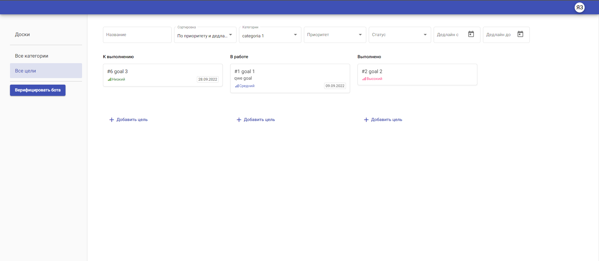

## YESHACALENDAR - Планировщик задач

*Проект реализует сайт планировщика задач, на сайте есть "доски", в которых может быть
несколько участников - редакторов и читателей. В досках можно создавать категории задач, 
а в категориях задач в свою очередь сами задачи.
У задач (целей) можно проставлять приоритет, дедлайны, статус, писать к ним комментарии. 
К приложению подключен телеграм бот.*

Необходимые инструменты:

*Python3.10, Django, Postgres*

Приложение можно поставить локально, для этого нужно поднять docker-compose up, запустится 5 контейнеров:
Фронтенд, АПИ, Постгрес, ТГ бот, миграции.

Приложение размещено в интернете по адресу http://yeshacalendar.ga/

Телеграм бот: https://t.me/yeshacalendar_bot

Проект сделан в рамках обучение в курсе python-developer от skypro, фронтенд стенд разработан
разработчиками skypro

Мои контакты:
*whatsapp/tg +79081905426, e-mail: scrolltrip@mail.ru*